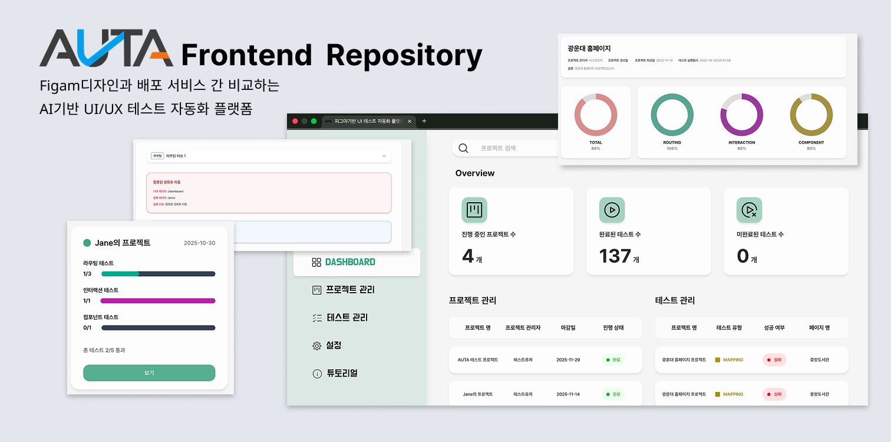
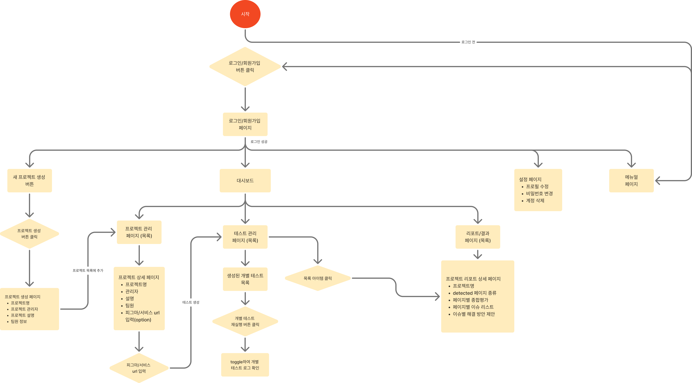
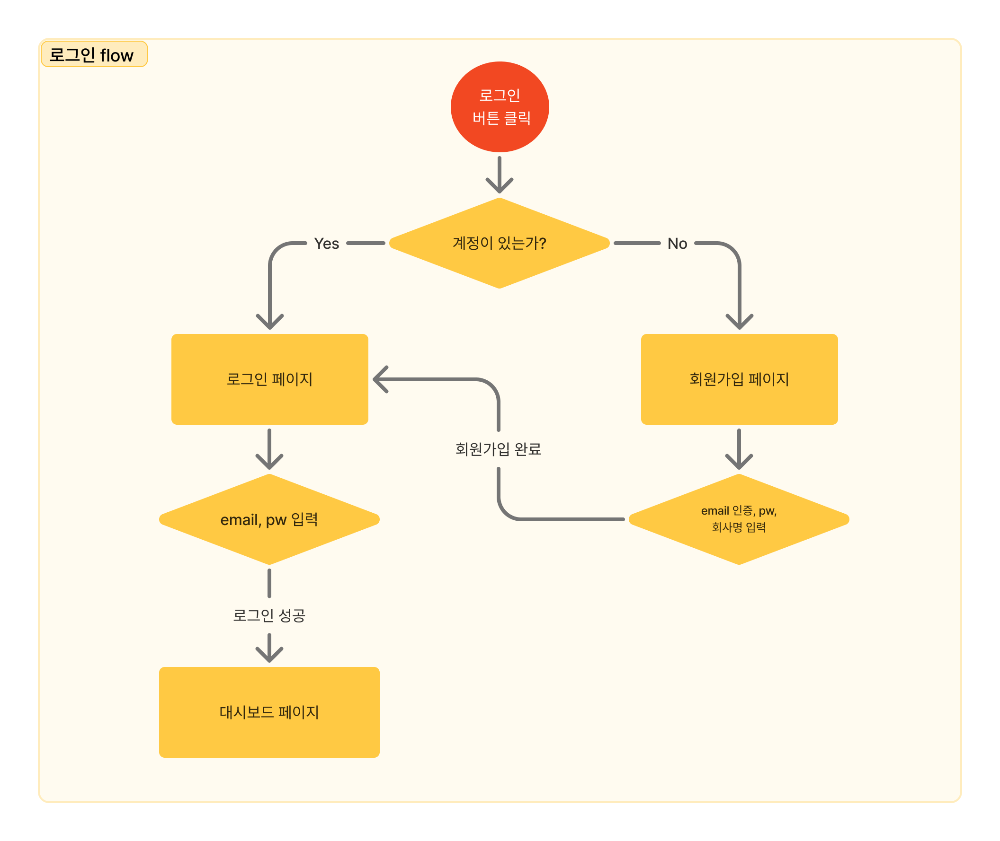
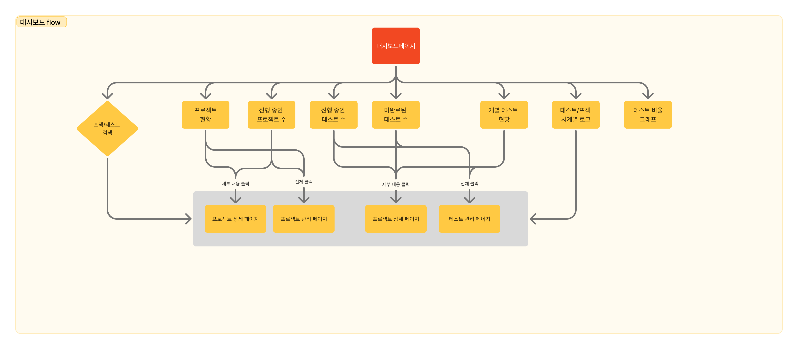

# AUTA Frontend

<div align="center">
  
</div>

## 목차
- [프로젝트 개요](#프로젝트-개요)
- [기술 스택](#기술-스택)
- [설치 및 실행](#설치-및-실행)
- [주요 기능](#주요-기능)
- [폴더 구조](#폴더-구조)
- [코딩 & Git 컨벤션](#코딩--git-컨벤션)
- [User Flow & Sitemap](#user-flow--sitemap)

---

## 프로젝트 개요
AUTA는 Figma 기반 UI/UX를 "코드 구현 결과물"과 자동으로 대조·검증해 주는 AI UI 테스트 자동화 플랫폼입니다.
디자인 시안과 실제 화면(웹/앱)의 스크린샷을 비교해 레이아웃/컴포넌트 불일치, 스타일 편차, 반응형 깨짐 같은 문제를 빠르게 탐지하고, 결과를 리포트·대시보드 형태로 정리해 QA 시간을 줄이고 디자인 준수 품질을 표준화하는 것을 목표로 합니다.

**개발 기간**
- 기획: `2025.1~2025.4`
- 개발: `2025.4~2025.10`

**프로젝트 구성원 (Frontend)**

<div align="ㅣㄷㄹ">

| Frontend | Frontend |
| :---: | :---: |
| **최현준** | **홍유진** |
| [ <br/> @hywznn](https://github.com/hywznn) | [ <br/> @youjin-hong](https://github.com/youjin-hong) |

</div>

---

## 기술 스택

<div align="center">


</div>

🔗 [Backend Repository 바로가기](https://github.com/KW-AUTA/server)

🔗 [AI Repository 바로가기](https://github.com/KW-AUTA/AI)

---

## 설치 및 실행

**1. 저장소 복제**
```bash
git clone https://github.com/KW-AUTA/client.git
cd client
```

**2. 종속성 설치**
```bash
npm install
```

**3. Git Hooks 설정**
```bash
npm run prepare  # husky 명시적으로 실행하기 위한 추가적인 명령어
```

**4. 개발 서버 실행**
```bash
npm run dev
```

---

## 주요 기능

**사용자 인증 및 세션 관리**
- OAuth 기반 로그인을 통해 안전하게 서비스에 접근할 수 있습니다.
- React Router와 Redux Toolkit을 활용한 전역 인증 상태 관리 및 보호된 라우팅을 구현했습니다.

**프로젝트 생성 및 관리**
- Figma 디자인과 연결할 프로젝트를 생성하고 목록에서 관리할 수 있습니다.
- TanStack Query의 캐싱과 낙관적 업데이트로 프로젝트 목록을 효율적으로 관리합니다.

**Figma 파일 연결 및 업로드**
- Figma API 연동 또는 파일 업로드를 통해 디자인 시안을 등록할 수 있습니다.
- Axios를 통한 파일 업로드 진행률 표시와 에러 핸들링을 구현했습니다.

**스크린샷 업로드 및 비교 요청**
- 실제 구현된 화면의 스크린샷을 업로드하고 Figma 디자인과 비교 분석을 요청할 수 있습니다.
- 드래그 앤 드롭 UI와 이미지 미리보기 기능을 제공합니다.

**실시간 비교 진행 상태 확인**
- 비교 작업의 진행 상황을 실시간으로 확인할 수 있습니다.
- Server-Sent Events(SSE)를 통해 백엔드 처리 상태를 실시간으로 수신하고 UI에 반영합니다.

**대시보드에서 결과 확인**
- 비교 결과를 한눈에 볼 수 있는 대시보드에서 프로젝트별 통계와 요약 정보를 확인할 수 있습니다.
- TanStack Query와 Redux Toolkit을 활용한 데이터 페칭 및 상태 관리로 대시보드 성능을 최적화했습니다.

**상세 리포트 및 이슈 확인**
- 탐지된 불일치 항목을 카테고리별(레이아웃/컴포넌트/스타일/반응형)로 필터링하여 상세히 확인할 수 있습니다.
- React Router의 동적 라우팅과 TanStack Query의 무한 스크롤을 활용한 이슈 목록 페이지를 구현했습니다.

**히스토리 관리 및 재실행**
- 이전 비교 결과를 히스토리에서 확인하고 동일한 설정으로 재실행할 수 있습니다.
- 로컬 스토리지와 Redux Persist를 활용한 사용자 설정 저장 기능을 제공합니다.


---

## 폴더 구조
```
front/
├── src/
│   ├── assets/           # 이미지, 폰트 등 정적 리소스
│   ├── components/       # 재사용 가능한 UI 컴포넌트
│   ├── pages/            # 페이지 컴포넌트
│   ├── hooks/            # 커스텀 React Hooks
│   ├── store/            # Redux Toolkit, TanStack Query 상태 관리
│   ├── services/api/     # API 통신 로직
│   ├── routes/           # React Router 라우팅 설정
│   ├── types/            # TypeScript 타입 정의
│   ├── utils/            # 유틸리티 함수
│   ├── constants/        # 상수 정의
│   ├── styles/           # 전역 스타일
│   └── App.tsx           # 루트 컴포넌트
├── public/               # 정적 파일 (favicon, images 등)
├── .husky/               # Git hooks (Husky)
└── scripts/              # 빌드/배포 스크립트
```

---

## 코딩 & Git 컨벤션

🔗 [코딩 컨벤션 바로가기](https://lovely-juniper-c4d.notion.site/1811c6afab8c80fcb7dfd49c974d5836)

🔗 [Git 컨벤션 바로가기](https://lovely-juniper-c4d.notion.site/Git-Github-flow-1811c6afab8c809d951ed06288f0009f?pvs=73)

---

## User Flow & Sitemap

<div align="center">

### AUTA userflow


### 로그인 flow


### 대시보드 flow


</div>
